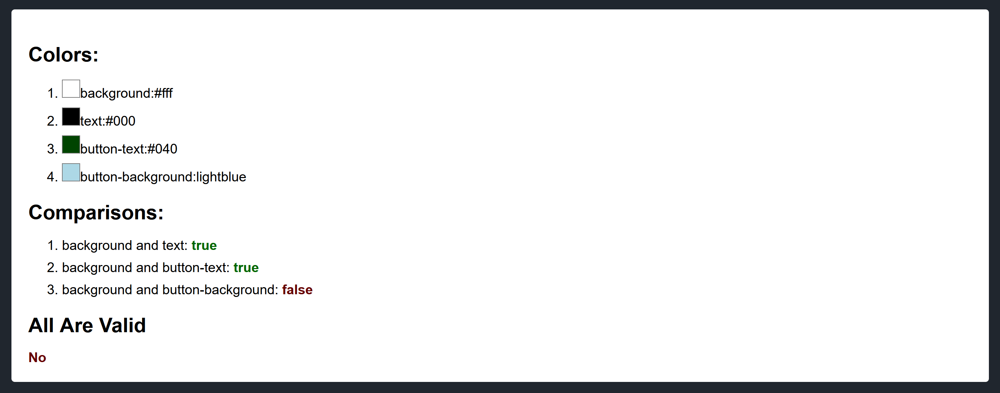

# Import the ColorChecker
```js
import ColorChecker from './components/color-checker';
```

# Create Arrays to store colors and comparisons
```js
  let colors = [
    { name: 'background', value: '#fff' },
    { name: 'text', value: '#000' },
    { name: 'button-text', value: '#040' },
    { name: 'button-background', value: 'lightgreen' }
  ];

  let comparisons = [
    { color1: 'background', color2: 'text' },
    { color1: 'background', color2: 'button-text' },
    { color1: 'background', color2: 'button-background' }
  ];
  ```

  # Place the component in JSX
  ```html
  <ColorChecker colors={colors} comparisons={comparisons} />
  ```

  # Result
  